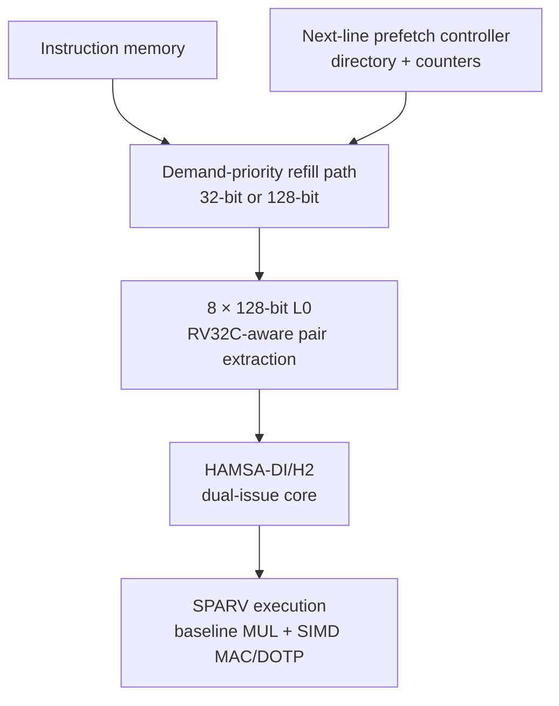

# SPARV: A Prefetch- and SIMD-Accelerated CV32E40P Research Core

[](https://github.com/mukullokhande99/cv32e40p/actions/workflows/sparv.yml)
[](https://github.com/mukullokhande99/cv32e40p/tree/feature/sparv)
[](LICENSE)

SPARV is a research-oriented extension of the 32-bit, in-order
[OpenHW Group CV32E40P](https://github.com/openhwgroup/cv32e40p) RISC-V core. It
combines the HAMSA-DI/H2 dual-issue foundation with an instruction-side L0,
low-priority next-line prefetching, and a multicycle SIMD MAC/dot-product
datapath for edge-AI and DSP workloads.

The branch retains the CV32E40P RV32IM\[F\]C and Xpulp baseline while adding
reproducible RTL-generation, simulation, metric collection, and PPA-evaluation
infrastructure. Existing Xpulp micro-operations drive the accelerated datapath;
the implementation does not invent an unpublished custom opcode encoding.

> **Research status:** the repository contains synthesizable RTL, focused unit
> tests, generated full-core variants, CI smoke tests, and evaluation tooling.
> Full architectural/compliance regressions and independently measured FPGA or
> ASIC results remain open; see the [completion checklist](docs/SPARV_COMPLETION_CHECKLIST.md).

## Highlights

| Capability | Implementation in this branch |
|---|---|
| Core foundation | CV32E40P with the HAMSA-DI/H2 asymmetric dual-issue backend |
| Instruction front end | 8-line × 128-bit L0 with RV32C-aware two-instruction extraction |
| Refill modes | Four 32-bit beats (`SPARV-32`) or one native 128-bit line (`SPARV-128`) |
| Prefetching | Next-line prefetching with strict demand priority and redundant-request suppression |
| Control-flow safety | Redirect and `FENCE.I` handling without architecturally consuming speculative data |
| Prefetch observability | Candidate, issued, fill, useful, wasted, and suppressed-event counters |
| Accelerated arithmetic | 4×INT8, 2×INT16, and 1×INT32 MAC/dot-product modes |
| Compatibility path | Baseline CV32E40P multiplier for standard MUL/MULH, rounded, MSU, and complex cases |
| Evaluation | Common B0/HAMSA/SPARV simulation, benchmark-matrix, metric, plot, and PPA drivers |
| Automation | Icarus Verilog unit tests, generated-core smoke tests, and Verilator lint in GitHub Actions |

## Architecture



The demand stream always has priority over speculative prefetch requests. A
shadow directory prevents redundant prefetches and classifies prefetched lines
as useful or wasted. In the execution stage, supported Xpulp `MUL_MAC32`,
`MUL_DOT8`, and non-complex `MUL_DOT16` micro-operations use the SPARV
multicycle engine; other multiplier operations follow the original CV32E40P
path.

## Configuration matrix

| Configuration | Core/front end | Refill interface | Accelerated MAC/DOTP |
|---|---|---|---|
| `B0` | Original CV32E40P | Original interface | No |
| `H2-32` | HAMSA-DI/H2 + L0 | 4 × 32-bit beats | No |
| `H2-128` | HAMSA-DI/H2 + L0 | Native 128-bit line | No |
| `SPARV-32` | HAMSA-DI/H2 + L0 + prefetch | 4 × 32-bit beats | Yes |
| `SPARV-128` | HAMSA-DI/H2 + L0 + prefetch | Native 128-bit line | Yes |

## Getting started

### Prerequisites

- Python 3.9 or newer for RTL/testbench generation and evaluation scripts
- Icarus Verilog for focused unit tests
- Verilator for full-core lint
- Questa/ModelSim for the supplied executable example-testbench flow
- A RISC-V firmware image in Verilog hex format for full-program simulation

Clone the repository and select this branch:

```bash
git clone https://github.com/mukullokhande99/cv32e40p.git
cd cv32e40p
git checkout feature/sparv
```

### Generate the full SPARV core

```bash
python3 util/gen_sparv_core.py
```

This generates:

- `rtl/cv32e40p_sparv_ex_stage.sv`
- `rtl/cv32e40p_core_sparv.sv`
- `cv32e40p_manifest_sparv.flist`

The generator first builds the HAMSA-DI/H2 foundation, then replaces the fetch
and multiplier integration points with the SPARV variants.

### Generate simulation variants

```bash
# Four 32-bit instruction-memory beats per 128-bit refill
python3 util/gen_sparv_sim.py --native 0

# Native 128-bit line refill
python3 util/gen_sparv_sim.py --native 1
```

Each command produces a wrapper, example-testbench top, subsystem variant, and
matching file manifest for its refill configuration.

### Run a firmware image

From the repository root, with a working Questa/ModelSim installation:

```bash
python3 evaluation/run_example_vsim.py SPARV-32  path/to/program.hex
python3 evaluation/run_example_vsim.py SPARV-128 path/to/program.hex
```

Use `--maxcycles` to change the default 20-million-cycle limit and
`--vsim-flags` to pass additional simulator arguments.

## Verification

The [`sparv.yml`](.github/workflows/sparv.yml) workflow exercises:

- next-line prefetch control, directory tracking, and demand-priority arbitration;
- SIMD MAC/DOTP reference and multicycle-engine behavior;
- integrated multiplier fallback, consecutive requests, result hold, and backpressure;
- SPARV instruction-fetch and accelerator-lane elaboration;
- SPARV-32 and SPARV-128 full-core/testbench generation;
- evaluation parser and mixed-configuration matrix smoke tests; and
- Verilator lint of the generated full core and SPARV-specific RTL.

For example, a focused arithmetic test can be run locally with Icarus Verilog:

```bash
iverilog -g2012 -o /tmp/sparv_mac_engine \
  rtl/cv32e40p_sparv_mac_dotp_ref.sv \
  rtl/cv32e40p_sparv_mac_dotp_engine.sv \
  bhv/cv32e40p_sparv_mac_dotp_engine_tb.sv
vvp /tmp/sparv_mac_engine
```

The CI workflow is the authoritative list of focused compile and lint commands.

## Evaluation workflow

SPARV simulations emit machine-readable `SPARV_METRIC key=value` records. The
included tooling collects cycles, retired instructions, dual-issued pairs, L0
activity, prefetch behavior, instruction-memory traffic, precision-specific
MAC/DOTP counts, and multicycle-engine stalls.

### Run a common benchmark matrix

```bash
python3 evaluation/run_benchmark_matrix.py \
  --benchmarks coremark,aes,dotp8,dotp16 \
  --configs B0,H2-32,H2-128,SPARV-32,SPARV-128 \
  --command './run_one.sh {configuration} {benchmark}' \
  --out evaluation/results/benchmark_matrix.csv
```

The supplied command must run one configuration/benchmark pair and print at
least a cycle counter in a `HAMSA_METRIC` or `SPARV_METRIC` line.

### Parse one SPARV log

```bash
python3 evaluation/parse_sparv_log.py simulation.log \
  --configuration SPARV-32 \
  --benchmark coremark \
  --output evaluation/results/coremark_sparv32.csv
```

### Drive a common PPA backend

```bash
python3 evaluation/run_ppa_matrix.py \
  --configs B0,H2-32,H2-128,SPARV-32,SPARV-128 \
  --command 'my_flow --manifest {manifest} --top {top} --out {outdir} {params}'
```

`run_ppa_matrix.py` deliberately provides no built-in PPA numbers. It applies
the same external synthesis or place-and-route command template to every
configuration and collects an optional `ppa.json` from each output directory.
Record the technology/library, PVT corner, clock constraint, activity source,
and memory assumptions with every result.

See [SPARV_EVALUATION.md](evaluation/SPARV_EVALUATION.md) and
[PPA_SETUP.md](evaluation/PPA_SETUP.md) for the complete methodology.

## Repository structure

| Path | Purpose |
|---|---|
| [`rtl/`](rtl/) | CV32E40P, HAMSA-DI/H2, and SPARV synthesizable SystemVerilog |
| [`bhv/`](bhv/) | Focused behavioral testbenches |
| [`util/gen_sparv_core.py`](util/gen_sparv_core.py) | Full-core and manifest generator |
| [`util/gen_sparv_sim.py`](util/gen_sparv_sim.py) | SPARV-32/SPARV-128 example-testbench generator |
| [`evaluation/`](evaluation/) | Simulation, parsing, matrix, plotting, and PPA drivers |
| [`docs/SPARV_COMPLETION_CHECKLIST.md`](docs/SPARV_COMPLETION_CHECKLIST.md) | Implemented, measured, and pending status |
| [`.github/workflows/sparv.yml`](.github/workflows/sparv.yml) | Reproducible SPARV smoke-test and lint flow |

## Reproduction boundary

The public SPARV description does not disclose the exact CORDIC
micro-rotation schedule or netlist for the combined Mult/Div/MAC/DOTP unit.
This branch reproduces the documented operation classes, SIMD widths, latency
contract, frontend behavior, and evaluation interfaces behind a replaceable
arithmetic kernel. It must not be described as a bit-for-bit reproduction of
unpublished CORDIC internals.

Likewise, reference figures from a paper are not repository measurements.
Performance, power, area, or frequency claims should be reported only after
running the supplied flows with a documented simulator, FPGA toolchain, or ASIC
backend.

## Upstream project and license

This repository is a derivative research branch of OpenHW Group's CV32E40P,
which originated in the PULP platform. The original core documentation is
available in [`docs/`](docs/) and through the
[CV32E40P user manual](https://docs.openhwgroup.org/projects/cv32e40p-user-manual/).
Please preserve the upstream copyright and attribution notices.

The hardware sources are distributed under the
[Solderpad Hardware License, Version 0.51](LICENSE). For academic use, cite the
upstream CV32E40P works listed in [`CITATION.cff`](CITATION.cff), together with
the relevant SPARV/HAMSA publication associated with the experiment.
